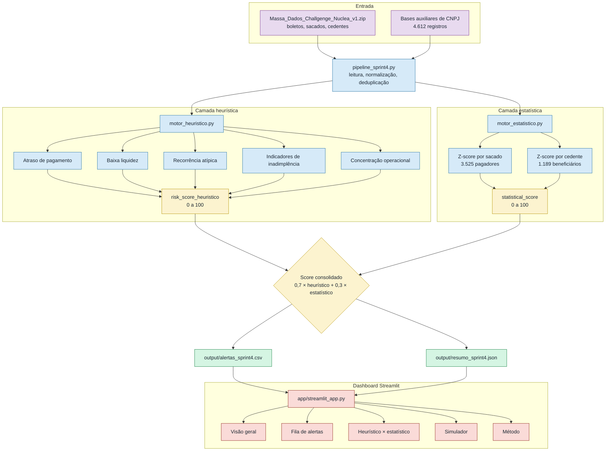

# DetectaFIDC

Console analítico para priorização de risco em **Fundos de Investimento em Direitos Creditórios (FIDCs)**.
Entrega final do Enterprise Challenge FIAP + Núclea, turma 1TSCO, equipe Data Vision.

**Aplicação ao vivo:** https://lucascarvalhal-detectafidc.hf.space

## Problema

FIDCs concentram milhares de duplicatas, sacados e cedentes em operações diárias. A análise manual de cada
boleto é inviável e os sinais de risco (atrasos, baixa liquidez, recorrência atípica, concentração operacional)
ficam diluídos no volume. O desafio proposto pela Núclea pedia uma camada analítica capaz de ler os dados
operacionais, enriquecê-los com bases auxiliares e priorizar os casos que merecem atenção, com explicação clara
para o analista.

## Proposta

Um motor de risco em duas camadas, com score explicável, dashboard interativo e simulador de cenários.

- **Camada heurística**, regras de negócio sobre atraso, liquidez, recorrência, espécie e indicadores de
  inadimplência. Cada alerta carrega seus motivos.
- **Camada estatística**, Z-score por sacado e por cedente, identificando boletos que se desviam do
  comportamento típico da entidade.
- **Score consolidado**, combinação ponderada `0,7 * heurístico + 0,3 * estatístico`, com explicação dos dois lados.

## Números da entrega

Resultado do pipeline executado sobre a massa oficial `Massa_Dados_Challgenge_Nuclea_v1.zip`:

| Item                                  | Valor   |
| ------------------------------------- | ------: |
| Boletos analisados                    |  7.118  |
| CNPJs auxiliares carregados           |  4.612  |
| Pagadores modelados estatisticamente  |  3.525  |
| Beneficiários modelados               |  1.189  |
| Score médio geral                     |  21,08  |
| Z médio                               |   0,74  |
| Z no percentil 99                     |   3,28  |

**Distribuição heurística:** 18 críticos, 471 altos, 955 médios, 5.674 baixos.
**Distribuição consolidada:** 3 críticos, 136 altos, 950 médios, 6.029 baixos.
**Camada estatística:** 95 anomalias fortes, 222 moderadas, 2.061 desvios leves, 4.740 normais.
**Divergências** entre as duas camadas (heurístico baixo, estatístico alto): 231 casos, indicando atenção
oculta que regras isoladas não enxergariam.

## O que está no dashboard

Cinco seções acessíveis pelo menu lateral.

1. **Visão geral**, KPIs principais em cards Carbon e distribuição dos níveis de risco.
2. **Fila de alertas**, tabela ordenada com filtros por nível, motivo e Unidade Federativa.
3. **Heurístico × estatístico**, comparação direta entre as duas camadas e leitura das divergências.
4. **Simulador**, calcula score em tempo real a partir de parâmetros operacionais inseridos manualmente.
5. **Método**, descrição da metodologia, regras e fórmula do score consolidado.

A interface segue a paleta IBM Carbon, com alternância entre modo claro e escuro pela barra lateral.

## Arquitetura do pipeline



O dashboard lê o CSV pré-gerado em `output/`. Isso permite hospedar a aplicação sem expor a massa de dados
e mantém o tempo de carregamento previsível.

## Estrutura do score

| Componente              | Faixa     | Origem                                                              |
| ----------------------- | --------- | ------------------------------------------------------------------- |
| `risk_score_heuristico` | 0 a 100   | Motor heurístico da Sprint 3, soma ponderada de regras de negócio.  |
| `statistical_score`     | 0 a 100   | Z-score por sacado e cedente, mapeado para uma escala 0 a 100.      |
| `score_consolidado`     | 0 a 100   | `0,7 * heuristico + 0,3 * estatistico`.                             |
| `motivo_estatistico`    | texto     | Resumo do desvio em relação à entidade.                             |
| `motivos_heuristico`    | lista     | Regras acionadas (atraso, liquidez, recorrência, etc.).             |

Cada alerta carrega ambos os lados, de forma que o analista entende por que aquele boleto subiu na fila.

## Stack

- **Python 3.11**, núcleo analítico em código puro, sem dependências externas obrigatórias na camada de regras.
- **Pandas**, manipulação tabular no pipeline.
- **Streamlit** + **Plotly** + **streamlit-option-menu**, interface, gráficos e navegação lateral.
- **Hugging Face Spaces**, hospedagem pública gratuita do dashboard.

Versionamento das dependências em `requirements.txt` com intervalos compatíveis (`streamlit>=1.40,<2.0`,
`plotly>=5.20,<6.0`, etc.).

## Estrutura do repositório

```
detectafidc/
├── app/
│   └── streamlit_app.py            Dashboard interativo
├── src/
│   ├── motor_heuristico.py         Motor de regras (Sprint 3)
│   ├── motor_estatistico.py        Camada Z-score por entidade
│   └── pipeline_sprint4.py         Orquestrador end-to-end
├── output/
│   ├── alertas_sprint4.csv         Alertas pré-gerados
│   └── resumo_sprint4.json         Resumo executivo do pipeline
├── .streamlit/
│   └── config.toml                 Tema e configurações da aplicação
├── requirements.txt                Dependências com versões
└── README.md
```

## Rodar localmente

```bash
python -m venv venv
source venv/bin/activate           # Windows: venv\Scripts\activate
pip install -r requirements.txt
streamlit run app/streamlit_app.py
```

O dashboard sobe em `http://localhost:8501`.

## Regerar o output a partir da massa oficial

Coloque `Massa_Dados_Challgenge_Nuclea_v1.zip` em `data/` e execute:

```bash
python src/pipeline_sprint4.py
```

O comando reconstrói `output/alertas_sprint4.csv` e `output/resumo_sprint4.json` aplicando as duas camadas
em sequência.

## Evolução das sprints

| Sprint | Período   | Entrega                                                                          |
| ------ | --------- | -------------------------------------------------------------------------------- |
| 1      | Nov/2025  | Ideação, problema, proposta de valor, contexto regulatório dos FIDCs.            |
| 2      | Dez/2025  | Arquitetura conceitual, stack tecnológico, protótipos de interface.              |
| 3      | Abr/2026  | MVP em Python com motor heurístico explicável e priorização inicial de alertas.  |
| 4      | Mai/2026  | Camada estatística Z-score, dashboard publicado, simulador interativo.           |

Entre a Sprint 2 e a Sprint 3 o escopo foi recalibrado, deixando autoencoder, Azure e Event Hubs como
próximos passos, com foco em uma entrega honesta, reprodutível e dentro do prazo acadêmico.

## Fora do escopo desta entrega

Itens identificados, intencionalmente deixados como próximos passos:

- Modelo supervisionado de fraude, condicionado à existência de rótulos confiáveis.
- Integração em tempo real com APIs da Núclea e ingestão por streaming.
- Implantação em ambiente produtivo com autenticação corporativa e governança de dados.
- Pipeline em nuvem (Azure) com Event Hubs, Synapse e Power BI.

## Equipe Data Vision, 1TSCO

- Andreza Dias Almeida Batista, RM 568336
- Kauê Marçal Pla Gil, RM 567950
- Lucas Carvalhal Pereira dos Santos, RM 567524
- Maria Eduarda Carmo da Silva, RM 568578

## Licença

MIT. Os dados utilizados no pipeline são fornecidos pela Núclea exclusivamente para fins acadêmicos no
contexto do Enterprise Challenge FIAP.
